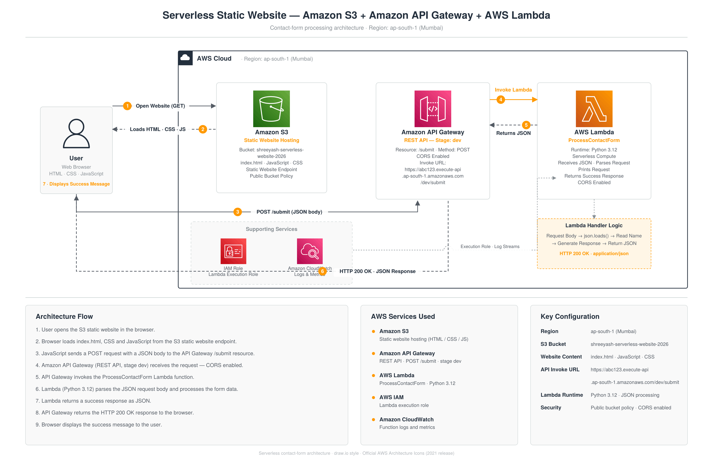
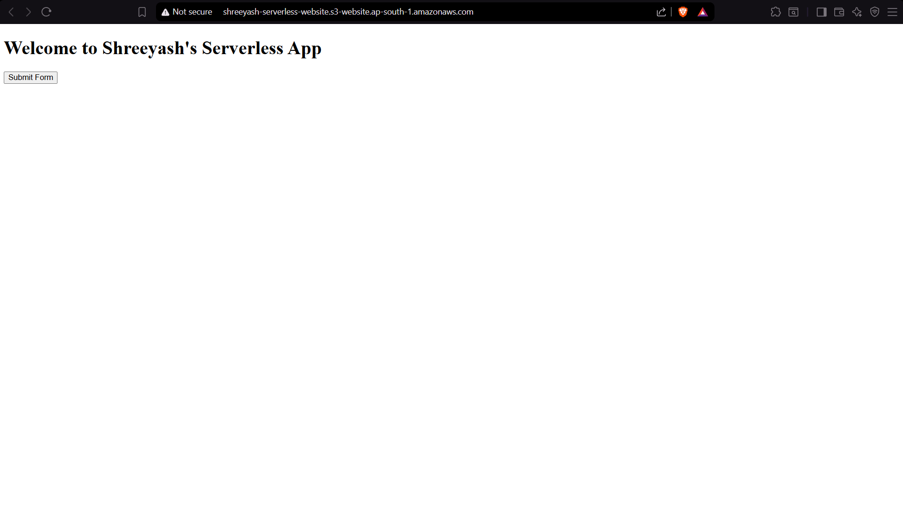

# 🚀 Serverless Static Website on AWS

A fully serverless web application built using **Amazon S3**, **Amazon API Gateway**, and **AWS Lambda**. The frontend is hosted as a static website on Amazon S3, while the backend is powered by AWS Lambda and exposed through a REST API using Amazon API Gateway.

This project demonstrates how to build a scalable, serverless web application without managing any EC2 servers.

---

# 📌 Project Overview

The application hosts a static website on Amazon S3. When a user clicks the **Submit Form** button, JavaScript sends a **POST** request to Amazon API Gateway.

API Gateway invokes an AWS Lambda function, which processes the JSON request and returns a success response back to the browser.

The entire architecture is completely serverless.

---

# 🏗️ Architecture Diagram



---

# 📸 Website Screenshot



---

# ⚙️ AWS Services Used

| Service | Purpose |
|----------|----------|
| Amazon S3 | Static Website Hosting |
| Amazon API Gateway | REST API Endpoint |
| AWS Lambda | Backend Processing |
| AWS IAM | Lambda Execution Role |
| Amazon CloudWatch | Logs & Monitoring |

---

# 🧱 Architecture Flow

```text
User
   │
   ▼
Amazon S3 Static Website
(index.html + CSS + JavaScript)
   │
   ▼
Browser loads website
   │
   ▼
POST Request (/submit)
   │
   ▼
Amazon API Gateway
   │
   ▼
AWS Lambda
(ProcessContactForm)
   │
   ▼
Process JSON Request
   │
   ▼
Return JSON Response
   │
   ▼
API Gateway
   │
   ▼
Browser displays success message
```

---

# 🔄 Request Flow

### Step 1

User opens the static website hosted on Amazon S3.

### Step 2

Amazon S3 serves:

- index.html
- CSS
- JavaScript

### Step 3

User clicks the **Submit Form** button.

### Step 4

JavaScript sends a POST request to Amazon API Gateway.

### Step 5

API Gateway invokes the AWS Lambda function.

### Step 6

Lambda processes the JSON payload.

### Step 7

Lambda returns an HTTP 200 success response.

### Step 8

The browser displays the success message.

---

# 📂 Project Structure

```
shreeyash-serverless-website/
│
├── README.md
├── architecture.png
├── final_website.png
├── index.html
└── lambda_backend.py
```

---

# 📄 Frontend

The frontend is built using:

- HTML5
- CSS3
- JavaScript
- Fetch API

Responsibilities:

- Display the website
- Send POST request
- Receive JSON response
- Display success message

---

# ⚡ Backend

Backend is built using:

- AWS Lambda
- Python 3.12

Responsibilities:

- Receive POST request
- Parse JSON body
- Process request
- Return JSON response

---

# 🌐 API Gateway

REST API Configuration

Method

```
POST
```

Resource

```
/submit
```

Stage

```
dev
```

CORS

```
Enabled
```

---

# ☁️ Amazon S3 Configuration

Static Website Hosting

```
Enabled
```

Index Document

```
index.html
```

Bucket Policy

```
Public Read Access
```

---

# 🔐 IAM

Lambda uses an IAM Execution Role with permissions to:

- Write logs to Amazon CloudWatch

---

# 📊 CloudWatch

Amazon CloudWatch automatically stores:

- Function Logs
- Execution Details
- Errors
- Monitoring Metrics

---

# 💻 Lambda Function Logic

```python
Receive Request
        │
        ▼
json.loads()
        │
        ▼
Read JSON Data
        │
        ▼
Generate Response
        │
        ▼
Return HTTP 200
```

---

# 📥 Sample Request

```json
{
    "name": "Shreeyash",
    "message": "Hello from S3 Website!"
}
```

---

# 📤 Sample Response

```json
""Hi Shreeyash, your form has been submitted successfully! 🎉""
```

---

# 🚀 Deployment Steps

## Step 1

Create an Amazon S3 Bucket.

---

## Step 2

Enable Static Website Hosting.

---

## Step 3

Upload

```
index.html
```

---

## Step 4

Create AWS Lambda Function.

---

## Step 5

Deploy Lambda Code.

---

## Step 6

Create REST API using Amazon API Gateway.

---

## Step 7

Create Resource

```
/submit
```

---

## Step 8

Create POST Method.

---

## Step 9

Integrate API Gateway with Lambda.

---

## Step 10

Enable CORS.

---

## Step 11

Deploy API.

---

## Step 12

Update API URL inside

```
index.html
```

---

## Step 13

Open the S3 Website Endpoint.

---

## Step 14

Click **Submit Form**.

---

# 📈 Features

- Fully Serverless Architecture
- Static Website Hosting
- REST API
- AWS Lambda Backend
- JSON Processing
- CORS Enabled
- Amazon CloudWatch Logging
- IAM Role Integration
- AWS Free Tier Friendly
- No EC2 Required
- Lightweight Architecture
- Easy to Deploy

---

# 📚 Technologies Used

- HTML5
- CSS3
- JavaScript
- Python 3.12
- AWS Lambda
- Amazon S3
- Amazon API Gateway
- IAM
- Amazon CloudWatch

---

# 🎯 Learning Outcomes

This project helped me understand:

- Serverless Computing
- Static Website Hosting
- REST APIs
- API Gateway Integration
- Lambda Functions
- JSON Request Handling
- IAM Roles
- CORS
- CloudWatch Logging
- AWS Architecture Design

---

# 📌 Future Improvements

- Amazon CloudFront
- Route 53
- HTTPS using ACM
- DynamoDB Integration
- Contact Form Validation
- Email Notifications using Amazon SES
- CI/CD using GitHub Actions
- Custom Domain

---

# 📷 Screenshots

## Architecture


---

## Website


---

# 👨‍💻 Author

**Shreeyash Thakre**

Electrical Engineering Undergraduate

Interested in:

- Cloud Computing
- AWS
- DevOps
- Automation Testing
- Serverless Architecture

GitHub

https://github.com/YOUR_GITHUB_USERNAME

---

# ⭐ If you found this project useful, please consider giving it a Star.
